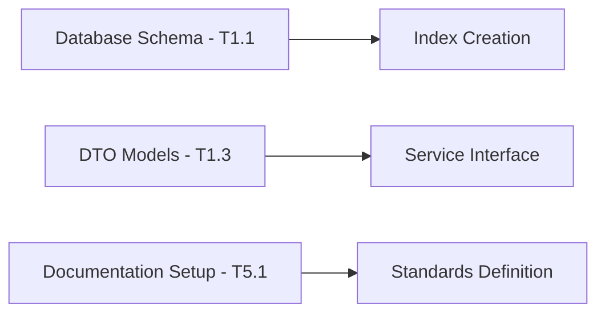
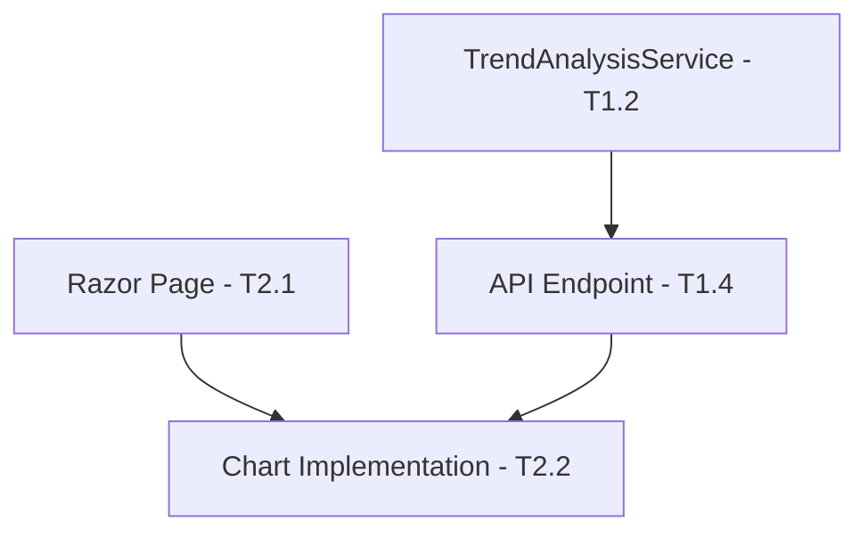
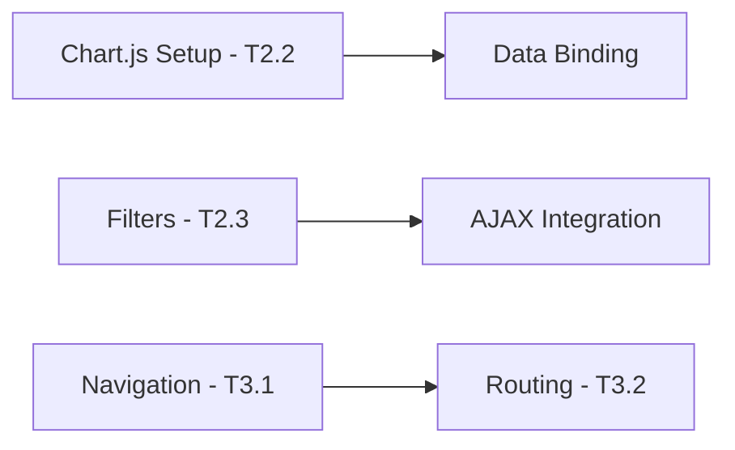
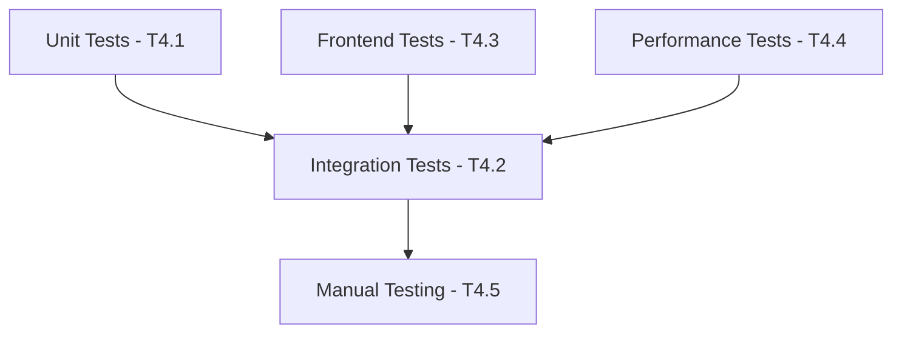
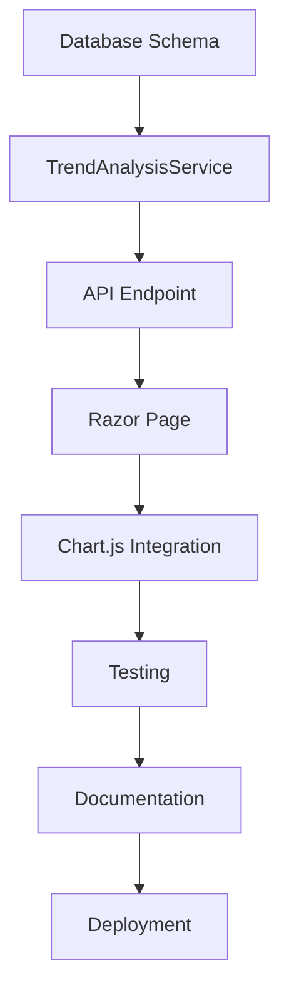

# Agent Orchestration Plan for Issue #7
## Feature: Line Charts for Individual Position Development Over Time

### Executive Summary
This orchestration plan details the multi-agent coordination strategy for implementing individual position trend analysis with line charts. The plan maximizes parallel execution while respecting critical dependencies and ensures comprehensive feature delivery.

---

## 1. Task Analysis & Decomposition

### 1.1 Backend Tasks (Database & Services)
- **T1.1** Database schema updates and indexing
- **T1.2** TrendAnalysisService implementation
- **T1.3** DTO models creation (TrendDataDto, PositionTrendDto)
- **T1.4** API endpoint development
- **T1.5** German number formatting utilities

### 1.2 Frontend Tasks (UI & Visualization)
- **T2.1** Razor page creation (PositionTrends.cshtml)
- **T2.2** Chart.js multi-line chart implementation
- **T2.3** Filter UI components (category dropdown, date range)
- **T2.4** Responsive design implementation
- **T2.5** German locale formatting for UI

### 1.3 Integration Tasks
- **T3.1** Navigation menu updates
- **T3.2** Routing configuration
- **T3.3** Error handling implementation
- **T3.4** Loading states and progress indicators

### 1.4 Testing Tasks
- **T4.1** Unit tests for TrendAnalysisService
- **T4.2** Integration tests for data flow
- **T4.3** Frontend component testing
- **T4.4** Performance testing with large datasets
- **T4.5** Manual testing and validation

### 1.5 Documentation Tasks
- **T5.1** Inline code documentation
- **T5.2** API documentation
- **T5.3** User guide updates

---

## 2. Agent Assignment Matrix

| Agent | Primary Tasks | Secondary Support | Expertise Match |
|-------|--------------|-------------------|-----------------|
| **dotnet-core-expert** | T1.1, T1.2, T1.3, T1.4, T1.5, T3.2, T3.3 | T4.1, T4.2 | Backend services, EF Core, API development |
| **frontend-developer** | T2.1, T2.2, T2.3, T2.4, T2.5, T3.1, T3.4 | T4.3 | Razor Pages, Chart.js, responsive UI |
| **test-automator** | T4.1, T4.2, T4.3, T4.4, T4.5 | - | Testing frameworks, performance testing |
| **documentation-engineer** | T5.1, T5.2, T5.3 | All tasks (inline docs) | Technical documentation |

---

## 3. Execution Phases & Dependencies

### Phase 1: Foundation (Parallel Execution)
**Duration: 2-3 hours**
**Agents: dotnet-core-expert, documentation-engineer**



**Tasks:**
- **dotnet-core-expert:**
  - T1.1: Add indexes for Category, Year, Month columns
  - T1.3: Create TrendDataDto and PositionTrendDto models
  - Begin T1.5: German formatting utilities setup

- **documentation-engineer:**
  - T5.1: Establish inline documentation standards
  - Begin documenting German business context

**Deliverables:**
- Optimized database indexes
- DTO model definitions
- Documentation framework

---

### Phase 2: Core Implementation (Parallel with Dependencies)
**Duration: 4-5 hours**
**Agents: dotnet-core-expert, frontend-developer**



**Tasks:**
- **dotnet-core-expert:**
  - T1.2: Implement TrendAnalysisService with:
    - GetPositionTrends(category, startDate, endDate)
    - GetAllCategories()
    - Aggregate monthly data logic
  - T1.4: Create API endpoint /api/trends/positions
  - Complete T1.5: German number formatting

- **frontend-developer:**
  - T2.1: Create PositionTrends.cshtml Razor page
  - T2.3: Build filter UI components
  - Prepare Chart.js integration structure

**Deliverables:**
- Functional backend service
- API endpoint ready
- Basic page structure

---

### Phase 3: Frontend Integration (Sequential + Parallel)
**Duration: 3-4 hours**
**Agents: frontend-developer, dotnet-core-expert**



**Tasks:**
- **frontend-developer:**
  - T2.2: Implement Chart.js multi-line chart:
    - Dynamic dataset creation
    - Color-coded lines per position
    - Interactive tooltips with German formatting
  - T2.4: Responsive design implementation
  - T2.5: German locale formatting
  - T3.1: Update navigation menu
  - T3.4: Loading states and spinners

- **dotnet-core-expert:**
  - T3.2: Configure routing
  - T3.3: Implement error handling
  - Support frontend with API adjustments

**Deliverables:**
- Fully functional chart visualization
- Responsive UI with filters
- Integrated navigation

---

### Phase 4: Testing & Quality Assurance (Parallel)
**Duration: 3-4 hours**
**Agents: test-automator, all agents for support**



**Tasks:**
- **test-automator:**
  - T4.1: Unit tests for TrendAnalysisService
    - Test data aggregation logic
    - Test German formatting
    - Test edge cases (empty data, single month)
  - T4.2: Integration tests
    - Database query performance
    - API endpoint response validation
  - T4.3: Frontend component tests
    - Chart rendering
    - Filter functionality
  - T4.4: Performance testing
    - Load test with 5+ years of data
    - Concurrent user simulation
  - T4.5: Manual testing coordination

**Support from other agents:**
- **dotnet-core-expert:** Fix backend issues discovered
- **frontend-developer:** Fix UI issues discovered
- **documentation-engineer:** Document test cases

**Deliverables:**
- Comprehensive test suite
- Performance benchmarks
- Bug fixes applied

---

### Phase 5: Documentation & Finalization (Sequential)
**Duration: 1-2 hours**
**Agents: documentation-engineer, all agents**

**Tasks:**
- **documentation-engineer:**
  - T5.2: Complete API documentation
  - T5.3: Update user guide
  - Review all inline documentation

- **All agents:**
  - Final code review
  - Documentation review
  - Deployment preparation

**Deliverables:**
- Complete documentation
- Deployment-ready feature

---

## 4. Critical Path & Dependencies



**Critical Dependencies:**
1. Database indexes must exist before service implementation
2. Service must be complete before API endpoint
3. API must be functional before frontend integration
4. Basic UI must exist before Chart.js implementation
5. All code complete before comprehensive testing

---

## 5. Parallel Execution Opportunities

### Maximum Parallelization Points:
1. **Phase 1:** Database + DTOs + Documentation (3 parallel tracks)
2. **Phase 2:** Backend service + Frontend structure (2 parallel tracks)
3. **Phase 4:** Unit + Integration + Frontend tests (3 parallel tracks)

### Resource Optimization:
- Frontend and backend development can proceed independently after interfaces defined
- Documentation can be written alongside development
- Test creation can begin as soon as interfaces are stable

---

## 6. Risk Mitigation Strategies

### Technical Risks:
1. **Chart.js Performance with Large Datasets**
   - Mitigation: Implement data sampling for >1000 points
   - Owner: frontend-developer

2. **Database Query Performance**
   - Mitigation: Proper indexing and query optimization
   - Owner: dotnet-core-expert

3. **German Formatting Inconsistencies**
   - Mitigation: Centralized formatting utilities
   - Owner: dotnet-core-expert

### Coordination Risks:
1. **API Contract Changes**
   - Mitigation: Define DTOs early and freeze after Phase 1
   - Owner: dotnet-core-expert

2. **Parallel Work Conflicts**
   - Mitigation: Clear file ownership boundaries
   - Owner: All agents

---

## 7. Success Metrics

### Quantitative Metrics:
- Chart load time < 2 seconds for 5 years of data
- API response time < 500ms for position trends
- Test coverage > 80% for new code
- Zero critical bugs in production

### Qualitative Metrics:
- Intuitive user interface requiring no training
- Consistent German number formatting throughout
- Smooth chart animations and interactions
- Clear visual distinction between positions

---

## 8. Communication Protocol

### Sync Points:
1. **Phase Transition Meetings**
   - Duration: 15 minutes
   - Purpose: Verify deliverables, adjust plan

2. **Daily Standups**
   - Quick status updates
   - Blocker identification
   - Dependency coordination

### Communication Channels:
- **Primary:** Shared project board with task status
- **Issues:** Immediate notification to affected agents
- **Code Reviews:** Async via pull requests

---

## 9. Execution Timeline

### Estimated Total Duration: 13-18 hours

| Phase | Duration | Agents | Parallel Factor |
|-------|----------|--------|-----------------|
| Phase 1 | 2-3h | 2 agents | 2x parallel |
| Phase 2 | 4-5h | 2 agents | 2x parallel |
| Phase 3 | 3-4h | 2 agents | 1.5x parallel |
| Phase 4 | 3-4h | 3 agents | 3x parallel |
| Phase 5 | 1-2h | 1 agent | Sequential |

### Optimized Schedule:
- With perfect parallelization: ~8 hours
- With realistic coordination: ~10-12 hours
- With buffer for issues: ~13-18 hours

---

## 10. Agent-Specific Instructions

### dotnet-core-expert:
```csharp
/**
 * Priority Focus Areas:
 * 1. Efficient LINQ queries for trend aggregation
 * 2. Proper async/await patterns for database operations
 * 3. German culture-specific formatting (de-DE)
 * 4. Comprehensive error handling with meaningful messages
 */
```

### frontend-developer:
```javascript
/**
 * Priority Focus Areas:
 * 1. Chart.js responsive configuration
 * 2. AJAX calls with proper error handling
 * 3. Loading states for better UX
 * 4. Mobile-first responsive design
 */
```

### test-automator:
```csharp
/**
 * Priority Focus Areas:
 * 1. Edge case coverage (empty data, single points)
 * 2. Performance benchmarks documentation
 * 3. Integration test data setup/teardown
 * 4. Browser compatibility testing
 */
```

### documentation-engineer:
```markdown
/**
 * Priority Focus Areas:
 * 1. German accounting context documentation
 * 2. API endpoint examples with curl/postman
 * 3. User workflow documentation with screenshots
 * 4. Inline code documentation per CLAUDE.md standards
 */
```

---

## 11. Delivery Checklist

### Backend Deliverables:
- [ ] Database indexes created and verified
- [ ] TrendAnalysisService fully implemented
- [ ] DTOs with proper validation
- [ ] API endpoint with error handling
- [ ] German formatting utilities
- [ ] Unit test coverage > 80%

### Frontend Deliverables:
- [ ] PositionTrends.cshtml page
- [ ] Chart.js multi-line implementation
- [ ] Filter UI with category dropdown
- [ ] Date range selector
- [ ] Responsive design verified
- [ ] Loading states implemented

### Integration Deliverables:
- [ ] Navigation menu updated
- [ ] Routing configured
- [ ] Error handling tested
- [ ] Performance validated

### Documentation Deliverables:
- [ ] Inline code documentation complete
- [ ] API documentation with examples
- [ ] User guide updated
- [ ] Test documentation

---

## 12. Post-Implementation Review

### Review Criteria:
1. Feature completeness against requirements
2. Performance metrics achievement
3. Code quality and maintainability
4. Documentation completeness
5. Test coverage and quality

### Lessons Learned Collection:
- Agent coordination effectiveness
- Parallel execution bottlenecks
- Technical challenges encountered
- Process improvements identified

---

## Conclusion

This orchestration plan provides a comprehensive roadmap for implementing the Line Charts for Individual Position Development feature. By leveraging parallel execution where possible and respecting critical dependencies, the team can deliver a high-quality feature efficiently.

The plan emphasizes:
- **Clear agent responsibilities** based on expertise
- **Maximum parallelization** without sacrificing quality
- **Risk mitigation** through proper planning
- **Quality assurance** through comprehensive testing
- **German business context** throughout implementation

Expected delivery: 10-12 hours of coordinated effort with all agents working at optimal efficiency.